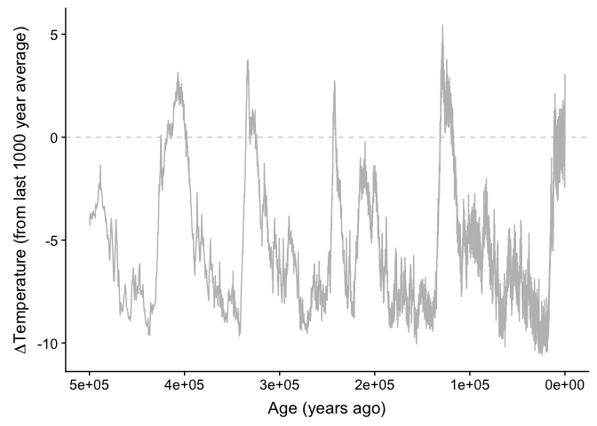
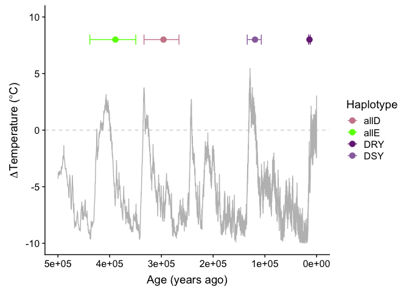
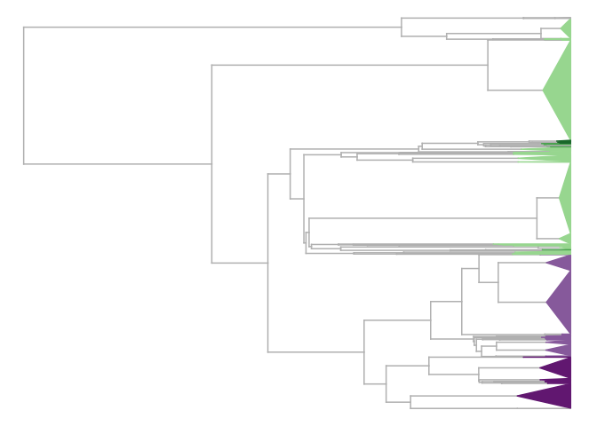
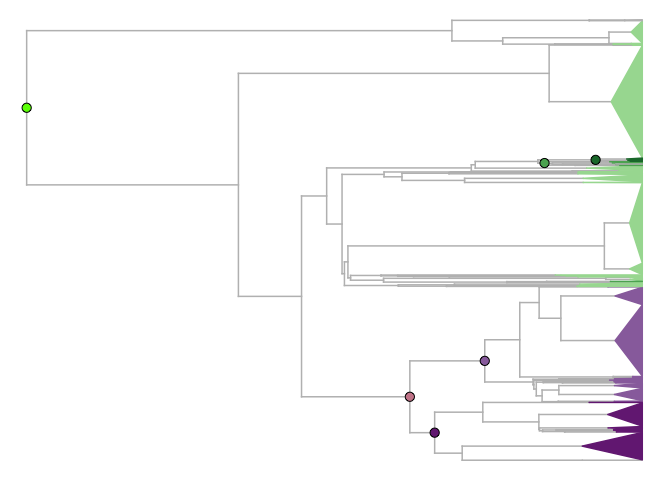
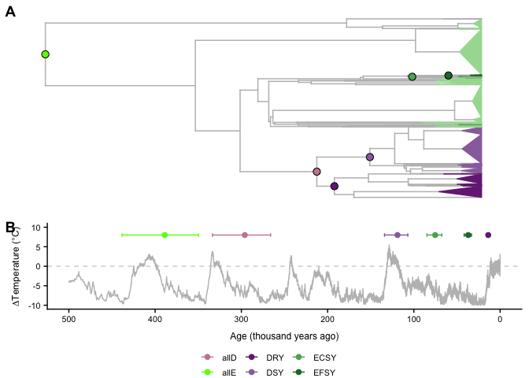

Population Genetic and Phylogenetic History of DOG1
================

DOG1 contains variants unassayed in the 1001 genomes VCF. We reassembled exon 1 of DOG1 using short reads. We assigned haplotype groups as in Nakabayashi et al., 2015, using the three to four amino acids of the self binding domain, at positions 13-16 of exon 1.

First, load some packages
-------------------------

Population Genetic Estimates of Age
===================================

We calculated pairwise diversity (pi) within haplotype groups, and between haplotype groups.

Although this is a crude approximation of time, we don't have to make assumptions about demography and selection (effectively ignoring them). Notably, this gives us information on the order of a few Ne generations.

read in the exon 1 fasta, and the haplotype assignment.
-------------------------------------------------------

``` r
aln=read.FASTA('~/Documents/berdeja_dog1/phylogeny/revbayes_e1dog1.nogaps.fa')

haplo=read.table('~/Documents/berdeja_dog1/haplotypes/dog1.may22.translated.phy', stringsAsFactors = F)
haplo$hap=substr(haplo$V2, 13,16)
haplo$hap=haplo$V2
```

set mu and its CI based on Ossowski et al 2010
----------------------------------------------

Variablemut is the mutation rate for the region of the chromosome DOG1 is found on.

``` r
mu=7.1e-9
mu.ci=c(6.3e-9,7.9e-9)
variablemut=9e-9
```

calculate pi within for each group
----------------------------------

``` r
dsy=nuc.div(aln[names(aln) %in% haplo$V1[haplo$hap=='D-SY']], pairwise.deletion=T)/2/c(mu, mu.ci,variablemut)
dry=nuc.div(aln[names(aln) %in% haplo$V1[haplo$hap=='D-RY']], pairwise.deletion=T)/2/c(mu, mu.ci,variablemut)
ds=nuc.div(aln[names(aln) %in% haplo$V1[haplo$hap%in%c('D-SY', 'D-RY')]], pairwise.deletion=T)/2/c(mu, mu.ci,variablemut)

## note these are not monophyletic, perhaps all samples is a better value??
es=nuc.div(aln[names(aln) %in% haplo$V1[haplo$hap%in%c('ECCY', 'ECSY', 'EFSY')]], pairwise.deletion=T)/2/c(mu, mu.ci,variablemut)

ecsy=nuc.div(aln[names(aln) %in% haplo$V1[haplo$hap%in%c('ECSY')]], pairwise.deletion=T)/2/c(mu, mu.ci,variablemut)
efsy=nuc.div(aln[names(aln) %in% haplo$V1[haplo$hap%in%c('EFSY')]], pairwise.deletion=T)/2/c(mu, mu.ci,variablemut)
```

make a data frame for easy use, with each haplotype divergence in it
--------------------------------------------------------------------

``` r
times=data.frame(DRY=dry, DSY=dsy, allD=ds, allE=es, ECSY=ecsy, EFSY=efsy)
times=data.frame(t(times))
colnames(times)=c('mu', 'mu.low', 'mu.high', 'mu.variable')
times$haplo=rownames(times)

### for posterity, write to file
#write.table(times, '~/Downloads/dog1_haplotype_divergence_times_pi.txt', col.names=T, row.names=F, sep='\t', quote=F)
#times=read.table('~/Downloads/dog1_haplotype_divergence_times_pi.txt', header=T)
```

Times then has the estimated timing of origin of these groups
-------------------------------------------------------------

``` r
times
```

    ##             mu    mu.low   mu.high mu.variable haplo
    ## DRY   13784.05  15534.41  12388.20    10874.09   DRY
    ## DSY  118971.86 134079.40 106924.08    93855.58   DSY
    ## allD 295999.48 333586.71 266024.84   233510.70  allD
    ## allE 388873.23 438253.95 349493.66   306777.77  allE
    ## ECSY  75257.85  84814.40  67636.80    59370.08  ECSY
    ## EFSY  36980.15  41676.04  33235.33    29173.23  EFSY

Now, we want to compare these times to geological events
========================================================

From NOAA, download EPICA Dome C [800KYr Deuterium Data and Temperature Estimates](https://www1.ncdc.noaa.gov/pub/data/paleo/icecore/antarctica/epica_domec/edc3deuttemp2007.txt).

[ORIGINAL REFERENCE](https://science.sciencemag.org/content/317/5839/793.long): Jouzel, J., V. Masson-Delmotte, O. Cattani, G. Dreyfus, S. Falourd, G. Hoffmann, B. Minster, J. Nouet, J.M. Barnola, J. Chappellaz, H. Fischer, J.C. Gallet, S. Johnsen, M. Leuenberger, L. Loulergue, D. Luethi, H. Oerter, F. Parrenin, G. Raisbeck, D. Raynaud, A. Schilt, J. Schwander, E. Selmo, R. Souchez, R. Spahni, B. Stauffer, J.P. Steffensen, B. Stenni, T.F. Stocker, J.L. Tison, M. Werner, and E.W. Wolff. 2007. Orbital and Millennial Antarctic Climate Variability over the Past 800,000 Years. Science, Vol. 317, No. 5839, pp.793-797, 10 August 2007.

\*<DATA:*>

EPICA Dome C bag deuterium data (LSCE, analytical accuracy of 0.5 per mille)

Temperature estimated after correction for sea-water isotopic composition (Bintanja et al, 2005) and for ice sheet elevation (Parrenin et al, 2007) on EDC3 age scale (Parrenin et al, 2007)

-   Column 1: Bag number (55 cm sample)
-   Column 2: Top depth (m)
-   Column 3: EDC3 age scale (years before year 1950)
-   Column 4: dD data (per mille with respect to SMOW)
-   Column 5: Temperature estimate (temperature difference from the average of the last 1000 years)

``` r
a=read.table('/Users/mcstitzer/Downloads/706973086_2019-05-09/data/pub/data/paleo/icecore/antarctica/epica_domec/edc3deuttemp2007.data.txt', fill=T, header=T)

a$kya=a$Age/1000
tail(a, 10)
```

    ##       Bag    ztop    Age Deuterium Temperature     kya
    ## 5791 5791 3184.50 793079   -423.50       -5.91 793.079
    ## 5792 5792 3185.05 793876   -427.10       -6.51 793.876
    ## 5793 5793 3185.60 794708   -432.00       -7.33 794.708
    ## 5794 5794 3186.15 795556   -437.30       -8.23 795.556
    ## 5795 5795 3186.70 796449   -439.00       -8.53 796.449
    ## 5796 5796 3187.25 797408   -440.20       -8.73 797.408
    ## 5797 5797 3187.80 798443   -439.00       -8.54 798.443
    ## 5798 5798 3188.35 799501   -441.10       -8.88 799.501
    ## 5799 5799 3188.90 800589   -441.42       -8.92 800.589
    ## 5800 5800 3189.45 801662   -440.90       -8.82 801.662

### what have the last 500k years looked like?

``` r
ggplot(a, aes(x=Age, y=Temperature))+ geom_hline(yintercept=0, lty='dashed', color='lightgray') + geom_line(color='gray') + xlim(500000,0) + ylab(expression(Delta*'Temperature (from last 1000 year average)')) + xlab('Age (years ago)') 
```

    ## Warning: Removed 614 rows containing missing values (geom_path).



now we can add on ages of dog1 events here
------------------------------------------

``` r
### purple and green colors
hapcolors=c('#762a83', '#762a83','#762a83', 
            '#9970ab', '#9970ab',
            '#a6dba0', 
            '#5aae61', 
            '#1b7837',
            '#cc8899',
            '#66ff00')
names(hapcolors)=c('D-RY', 'DRY','DR-Y', 
                   'D-SY','DSY', 
                   'ECCY', 
                   'ECSY', 
                   'EFSY',
                   'allD',
                   'allE')

temperature=ggplot(a, aes(x=Age, y=Temperature))+ geom_hline(yintercept=0, lty='dashed', color='lightgray') + geom_line(color='gray') + xlim(500000,0) + ylab(expression(Delta*'Temperature ('*degree*'C)')) + xlab('Age (years ago)') + ylim(-10,10) + geom_errorbarh(data=times[times$haplo != c('ECSY', 'EFSY'),], aes(x=mu, y=8, xmax = mu.high, xmin = mu.low, color=haplo), inherit.aes = F) + geom_point(data = times[times$haplo != c('ECSY', 'EFSY'),], aes(x=mu, y=8, color=haplo), size=3, inherit.aes = F) + scale_color_manual(values=hapcolors) + labs(color='Haplotype')
```

    ## Warning: Ignoring unknown aesthetics: x

``` r
## Add to figure legend:  from last 1000 year average

temperature
```

    ## Warning: Removed 614 rows containing missing values (geom_path).



``` r
## also try with ecsy and efsy. 
temperature.alle=ggplot(a, aes(x=kya, y=Temperature))+ geom_hline(yintercept=0, lty='dashed', color='lightgray') + geom_line(color='gray') + xlim(500,0) + ylab(expression(Delta*'Temperature ('*degree*'C)')) + xlab('Age (thousand years ago)') + ylim(-10,10) + geom_errorbarh(data=times, aes(x=mu/1000, y=8, xmax = mu.high/1000, xmin = mu.low/1000, color=haplo), inherit.aes = F) + geom_point(data = times, aes(x=mu/1000, y=8, color=haplo), size=2, inherit.aes = F) + scale_color_manual(values=hapcolors) + labs(color='Haplotype') 
```

    ## Warning: Ignoring unknown aesthetics: x

``` r
#+ scale_x_continuous(breaks=c(5e5,4e5,3e5,2e5,1e5,0),
#        labels=c(500,400,300,200,100,0))
```

Now add in phylogeny
--------------------

i overwrote the native phytools function of the same name with this - not sure if i need this!
----------------------------------------------------------------------------------------------

``` r
getDescendants<-function(tree,node,curr=NULL){
  if(is.null(curr)) curr<-vector()
  daughters<-tree$edge[which(tree$edge[,1]==node),2]
  curr<-c(curr,daughters)
  w<-which(daughters>=length(tree$tip))
  if(length(w)>0) for(i in 1:length(w)) 
    curr<-getDescendants(tree,daughters[w[i]],curr)
  return(curr)
}
```

heres a try coloring branchesk not working!
-------------------------------------------

this is a phytools function I modified to plot branches in color
----------------------------------------------------------------

get info about mapping individual sequences to the collapsed unique sequences
-----------------------------------------------------------------------------

``` r
fatips=fread('grep ">" ~/Documents/berdeja_dog1/phylogeny/pruned_e1_aln.haplonames.fa', header=F)
fatips$V1=gsub(pattern = ">", replacement = '', fatips$V1)

fainds=fread('grep ">" ~/Documents/berdeja_dog1/phylogeny/pruned_e1_aln.fa', header=F, sep='\t')
fainds$V1=gsub(pattern = ">", replacement = '', fainds$V1)
fainds$count=str_count(fainds$V1, ',')
fatips$count=fainds$count
```

read in the tree
----------------

``` r
single=read.beast('~/Documents/berdeja_dog1/phylogeny/pruned_e1_aln.tre')
stree=single
hs=data.frame(V1=single@phylo$tip.label, hap=str_split_fixed(single@phylo$tip.label, '_', 2)[,1])
```

convert to backbonePhylo and plot
---------------------------------

``` r
xtra2=as.phylo(stree)
n<-length(xtra2$tip.label)
ee<-setNames(xtra2$edge.length[sapply(1:n,function(x,y)   which(y==x),y=xtra2$edge[,2])],xtra2$tip.label)
##trans needs: tip.label clade.label  N     depth
trans=data.frame(tip.label=xtra2$tip.label, clade.label=hs$hap, 
                 N=fatips$count*10, 
                depth=ee/3)

rownames(trans)<-NULL
tt<-phylo.toBackbone(drop.tip(xtra2, c('ESCY_8', 'ESCY_62')),trans)
plot.backbonePhylo_color(tt, vscale=0.1, fixed.height=F, col=hapcolors, lwd=1.5)
```

    ## [1] 969



get mrcas for each clade
------------------------

``` r
    dsyMRCA<-findMRCA(tt, which(sapply(tt$tip.clade, function(y) y$label)=='D-SY'))
    dryMRCA<-findMRCA(tt, which(sapply(tt$tip.clade, function(y) y$label) %in% c('DR-Y', 'D-RY')))
    efsyMRCA<-findMRCA(tt, which(sapply(tt$tip.clade, function(y) y$label) %in% c('EFSY')))
    ecsyMRCA<-findMRCA(tt, which(sapply(tt$tip.clade, function(y) y$label) %in% c('ECSY'))[-2])
    alldMRCA<-findMRCA(tt, which(sapply(tt$tip.clade, function(y) y$label) %in% c('D-RY', 'DR-Y', 'D-SY')))
```

to combine the two, use a function and cowplot
----------------------------------------------

``` r
plot.backbonePhylo_color(tt, vscale=0.1, fixed.height=F, col=hapcolors, lwd=1.5)
```

    ## [1] 969

``` r
nodelabels('', node=dsyMRCA, col=hapcolors['D-SY'], bg = hapcolors['D-SY'], frame='circle', cex=0.5)
nodelabels('', node=dryMRCA, col=hapcolors['D-RY'], bg = hapcolors['D-RY'], frame='circle', cex=0.5)
nodelabels('', node=efsyMRCA, col=hapcolors['EFSY'], bg = hapcolors['EFSY'], frame='circle', cex=0.5)
nodelabels('', node=ecsyMRCA, col=hapcolors['ECSY'], bg = hapcolors['ECSY'], frame='circle', cex=0.5)
nodelabels('', node=alldMRCA, col=hapcolors['allD'], bg = hapcolors['allD'], frame='circle', cex=0.5)
nodelabels('', node=73, col=hapcolors['allE'], bg = hapcolors['allE'], frame='circle', cex=0.5)
```



``` r
treeplot=recordPlot()

## extract legend
legend=get_legend(temperature.alle + theme(legend.position="bottom", legend.justification="center" , legend.text=element_text(size=8), axis.title=element_text(size=9))+ guides(colour = guide_legend(nrow = 2)) + labs(color=''))
```

    ## Warning: Removed 614 rows containing missing values (geom_path).

``` r
plot_grid(treeplot, temperature.alle + theme(legend.position="none", axis.text=element_text(size=8), axis.title=element_text(size=9)), legend, labels = c('A', 'B', ''), 
          scale = c(0.9, 1,1), ncol=1, rel_heights=c(0.8,0.5,0.1))
```

    ## Warning: Removed 614 rows containing missing values (geom_path).



``` r
pdf('~/Downloads/dog1_tree_figure_july8.pdf',width = 3.4,7) ## pnas 8.7 cm for width of column, suggests starting with 9 inches for max height (b/c need figure legend)
plot_grid(treeplot, temperature.alle + theme(legend.position="none", axis.text=element_text(size=8), axis.title=element_text(size=9)), legend, labels = c('A', 'B', ''), 
          scale = c(0.9, 1,1), ncol=1, rel_heights=c(0.8,0.5,0.1))
```

    ## Warning: Removed 614 rows containing missing values (geom_path).

``` r
dev.off()
```

    ## quartz_off_screen 
    ##                 2
