Population Genetic and Phylogenetic History of DOG1
================

DOG1 contains variants unassayed in the 1001 genomes VCF. We reassembled exon 1 of DOG1 using short reads. We assigned haplotype groups as in Nakabayashi et al., 2015, using the three to four amino acids of the self binding domain, at positions 13-16 of exon 1.

First, load some packages
-------------------------

Population Genetic Estimates of Age
===================================

We calculated pairwise diversity (pi) within haplotype groups, and between haplotype groups.

Although this is a crude approximation of time, we don't have to make assumptions about demography and selection (effectively ignoring them). Notably, this gives us information on the order of a few Ne generations.

read in the exon 1 fasta, and the haplotype assignment.
-------------------------------------------------------

``` r
aln=read.FASTA('~/Documents/berdeja_dog1/phylogeny/revbayes_e1dog1.nogaps.fa')

haplo=read.table('/Users/mcstitzer/Documents/berdeja_dog1/phylogeny/data_files/revbayes_e1dog1.translated.phy', stringsAsFactors = F)
haplo$hap=substr(haplo$V2, 13,16)
table(haplo$hap)
```

    ## 
    ##      ---- ---Y --XY -XCY -XSY D-CY D-RY D-SY DR-Y ECCY ECSY ECYY EFSY ESCY 
    ##    1   85    1    2    3    1    4  196  344    2  375   23   52   35    2 
    ## EYSY XFSY 
    ##    1    1

``` r
## remove gaps that we can't identify
haplo$hap[!haplo$hap %in% c('C-CY', 'D-CY', 'D-SY', 'D-RY', 'ECCY', 'ECSY', 'EFSY', 'ESCY', 'EYSY')]='not assigned'
```

set mu and its CI based on Ossowski et al 2010
----------------------------------------------

Variablemut is the mutation rate for the region of the chromosome DOG1 is found on.

``` r
mu=7.1e-9 # subs/site/gen
mu.ci=c(6.3e-9,7.9e-9)
variablemut=9e-9
#subs=2.11e-9 ## exposito-alonzo 2018, in subs/site/yr
subs=2.7e-9 ## exposito-alonzo 2018, in subs/site/gen, assuming 1.3 yrs per gen.
weng.all=6.95e-9
weng.genic=3.35e-9
gentime=1.3 ## this is years per generation
```

calculate pi within for each group
----------------------------------

``` r
dsy=nuc.div(aln[names(aln) %in% haplo$V1[haplo$hap=='D-SY']], pairwise.deletion=T)/2/c(mu, mu.ci,variablemut, subs, weng.all,weng.genic)
dry=nuc.div(aln[names(aln) %in% haplo$V1[haplo$hap=='D-RY']], pairwise.deletion=T)/2/c(mu, mu.ci,variablemut, subs, weng.all, weng.genic)
ds=nuc.div(aln[names(aln) %in% haplo$V1[haplo$hap%in%c('D-SY', 'D-RY')]], pairwise.deletion=T)/2/c(mu, mu.ci,variablemut, subs, weng.all, weng.genic)

## note these are not monophyletic, perhaps all samples is a better value??
es=nuc.div(aln[names(aln) %in% haplo$V1[haplo$hap%in%c('ECCY', 'ECSY', 'EFSY')]], pairwise.deletion=T)/2/c(mu, mu.ci,variablemut, subs, weng.all, weng.genic)

eall=nuc.div(aln[names(aln) %in% haplo$V1[!haplo$hap%in%c('ECYY')]], pairwise.deletion=T)/2/c(mu,mu.ci,variablemut, subs, weng.all, weng.genic)

ecsy=nuc.div(aln[names(aln) %in% haplo$V1[haplo$hap%in%c('ECSY') & haplo$V1!='_R_SRR1946455.fna.Contig4']], pairwise.deletion=T)/2/c(mu, mu.ci,variablemut, subs, weng.all, weng.genic) ## get rid of the far out (likely independent origin ecsy)
efsy=nuc.div(aln[names(aln) %in% haplo$V1[haplo$hap%in%c('EFSY')]], pairwise.deletion=T)/2/c(mu, mu.ci,variablemut, subs, weng.all, weng.genic)
```

make a data frame for easy use, with each haplotype divergence in it
--------------------------------------------------------------------

``` r
times=data.frame(DRY=dry, DSY=dsy, allD=ds, allE=es, ECSY=ecsy, EFSY=efsy)
times=data.frame(t(times))
times=times*gentime ## n generations * 1.3 years/gen
colnames(times)=c('mu', 'mu.low', 'mu.high', 'mu.variable', 'substitution', 'weng.all', 'weng.genic')

times.low=times/gentime ## this is the low one yr/gen
times.high=times/gentime*1.6 ## this is the high 1.6 yrs/gen
colnames(times.low)=paste0(colnames(times.low), '_lowgen')
colnames(times.high)=paste0(colnames(times.high), '_highgen')

times$haplo=rownames(times)
times$haplo[times$haplo=='DRY']='D-RY'
times$haplo[times$haplo=='DSY']='D-SY'
times.all=cbind(times, cbind(times.low, times.high))

### for posterity, write to file
#write.table(times[,-4], '~/Downloads/dog1_haplotype_divergence_times_pi.txt', col.names=T, row.names=F, sep='\t', quote=F)
#times=read.table('~/Downloads/dog1_haplotype_divergence_times_pi.txt', header=T)
```

Times then has the estimated timing of origin of these groups
-------------------------------------------------------------

``` r
times
```

    ##             mu    mu.low   mu.high mu.variable substitution  weng.all
    ## DRY   15523.19  17494.39  13951.22    12246.07     40820.24  15858.22
    ## DSY  114793.04 129369.93 103168.42    90558.95    301863.17 117270.58
    ## allD 365350.29 411743.98 328352.79   288220.78    960735.95 373235.55
    ## allE 526315.99 593149.76 473018.17   415204.83   1384016.11 537675.33
    ## ECSY  92943.45 104745.79  83531.45    73322.05    244406.84  94949.42
    ## EFSY  48074.20  54178.86  43205.92    37925.20    126417.33  49111.77
    ##      weng.genic haplo
    ## DRY    32899.89  D-RY
    ## DSY   243292.70  D-SY
    ## allD  774324.50  allD
    ## allE 1115475.67  allE
    ## ECSY  196984.62  ECSY
    ## EFSY  101888.60  EFSY

Now, we want to compare these times to geological events
========================================================

From NOAA, download EPICA Dome C [800KYr Deuterium Data and Temperature Estimates](https://www1.ncdc.noaa.gov/pub/data/paleo/icecore/antarctica/epica_domec/edc3deuttemp2007.txt).

[ORIGINAL REFERENCE](https://science.sciencemag.org/content/317/5839/793.long): Jouzel, J., V. Masson-Delmotte, O. Cattani, G. Dreyfus, S. Falourd, G. Hoffmann, B. Minster, J. Nouet, J.M. Barnola, J. Chappellaz, H. Fischer, J.C. Gallet, S. Johnsen, M. Leuenberger, L. Loulergue, D. Luethi, H. Oerter, F. Parrenin, G. Raisbeck, D. Raynaud, A. Schilt, J. Schwander, E. Selmo, R. Souchez, R. Spahni, B. Stauffer, J.P. Steffensen, B. Stenni, T.F. Stocker, J.L. Tison, M. Werner, and E.W. Wolff. 2007. Orbital and Millennial Antarctic Climate Variability over the Past 800,000 Years. Science, Vol. 317, No. 5839, pp.793-797, 10 August 2007.

\*<DATA:*>

EPICA Dome C bag deuterium data (LSCE, analytical accuracy of 0.5 per mille)

Temperature estimated after correction for sea-water isotopic composition (Bintanja et al, 2005) and for ice sheet elevation (Parrenin et al, 2007) on EDC3 age scale (Parrenin et al, 2007)

-   Column 1: Bag number (55 cm sample)
-   Column 2: Top depth (m)
-   Column 3: EDC3 age scale (years before year 1950)
-   Column 4: dD data (per mille with respect to SMOW)
-   Column 5: Temperature estimate (temperature difference from the average of the last 1000 years)

``` r
a=read.table('/Users/mcstitzer/Downloads/706973086_2019-05-09/data/pub/data/paleo/icecore/antarctica/epica_domec/edc3deuttemp2007.data.txt', fill=T, header=T)

a$kya=a$Age/1000
tail(a, 10)
```

    ##       Bag    ztop    Age Deuterium Temperature     kya
    ## 5791 5791 3184.50 793079   -423.50       -5.91 793.079
    ## 5792 5792 3185.05 793876   -427.10       -6.51 793.876
    ## 5793 5793 3185.60 794708   -432.00       -7.33 794.708
    ## 5794 5794 3186.15 795556   -437.30       -8.23 795.556
    ## 5795 5795 3186.70 796449   -439.00       -8.53 796.449
    ## 5796 5796 3187.25 797408   -440.20       -8.73 797.408
    ## 5797 5797 3187.80 798443   -439.00       -8.54 798.443
    ## 5798 5798 3188.35 799501   -441.10       -8.88 799.501
    ## 5799 5799 3188.90 800589   -441.42       -8.92 800.589
    ## 5800 5800 3189.45 801662   -440.90       -8.82 801.662

### what have the last 500k years looked like?

``` r
ggplot(a, aes(x=Age, y=Temperature))+ geom_hline(yintercept=0, lty='dashed', color='lightgray') + geom_line(color='gray') + xlim(500000,0) + ylab(expression(Delta*'Temperature (from last 1000 year average)')) + xlab('Age (years ago)') 
```

    ## Warning: Removed 614 rows containing missing values (geom_path).

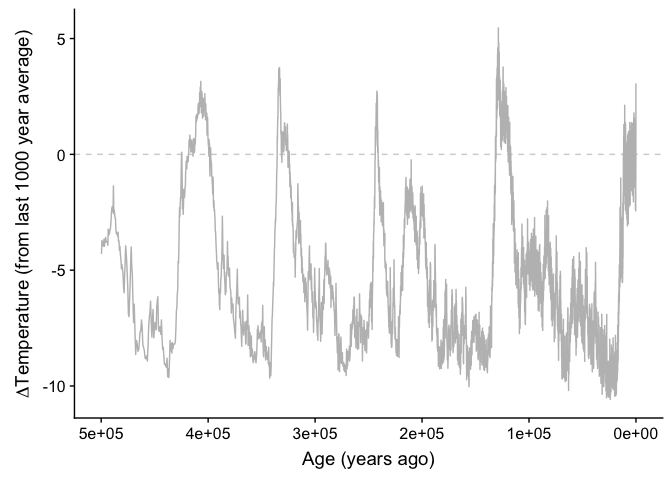

now we can add on ages of dog1 events here
------------------------------------------

``` r
### purple and green colors
hapcolors=c('#762a83', '#762a83','#762a83', 
            '#9970ab', '#9970ab',
            '#a6dba0', '#a6dba0',
            '#5aae61', 
            '#1b7837',
            '#cc8899',
            '#66ff00')
names(hapcolors)=c('D-RY', 'DRY','DR-Y', 
                   'D-SY','DSY', 
                   'ECCY', 'ECYY',
                   'ECSY', 
                   'EFSY',
                   'allD',
                   'allE')

temperature=ggplot(a, aes(x=Age, y=Temperature))+ geom_hline(yintercept=0, lty='dashed', color='lightgray') + geom_line(color='gray') + xlim(500000,0) + ylab(expression(Delta*'Temperature ('*degree*'C)')) + xlab('Age (years ago)') + ylim(-10,10) + geom_errorbarh(data=times[times$haplo != c('ECSY', 'EFSY'),], aes(x=mu, y=8, xmax = mu.high, xmin = mu.low, color=haplo), inherit.aes = F) + geom_point(data = times[times$haplo != c('ECSY', 'EFSY'),], aes(x=mu, y=8, color=haplo), size=3, inherit.aes = F) + scale_color_manual(values=hapcolors) + labs(color='Haplotype')
```

    ## Warning: Ignoring unknown aesthetics: x

``` r
## Add to figure legend:  from last 1000 year average

temperature
```

    ## Warning: Removed 614 rows containing missing values (geom_path).

    ## Warning: Removed 1 rows containing missing values (geom_errorbarh).

    ## Warning: Removed 1 rows containing missing values (geom_point).

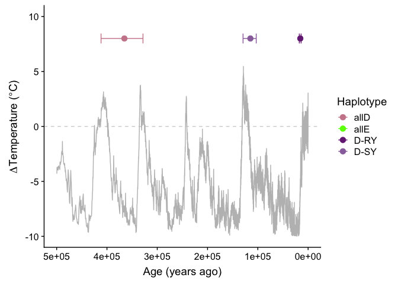

``` r
## also try with ecsy and efsy.
temperature.alle=ggplot(a, aes(x=kya, y=Temperature))+ geom_hline(yintercept=0, lty='dashed', color='lightgray') + geom_line(color='gray') + xlim(500,0) + ylab(expression(Delta*'Temperature ('*degree*'C)')) + xlab('Age (thousand years ago)') + ylim(-10,10) + geom_errorbarh(data=times.all[times.all$haplo!='allE',], aes(x=mu/1000, y=8, xmax = mu_lowgen/1000, xmin = mu_highgen/1000, color=haplo), inherit.aes = F) + geom_point(data = times[times$haplo!='allE',], aes(x=mu/1000, y=8, color=haplo), size=2, inherit.aes = F) + scale_color_manual(values=hapcolors) + labs(color='Haplotype') 
```

    ## Warning: Ignoring unknown aesthetics: x

``` r
#+ scale_x_continuous(breaks=c(5e5,4e5,3e5,2e5,1e5,0),
#        labels=c(500,400,300,200,100,0))
```

compare mu, substitution rate, generation time
----------------------------------------------

Now add in phylogeny
--------------------

i overwrote the native phytools function of the same name with this - not sure if i need this!
----------------------------------------------------------------------------------------------

``` r
getDescendants<-function(tree,node,curr=NULL){
  if(is.null(curr)) curr<-vector()
  daughters<-tree$edge[which(tree$edge[,1]==node),2]
  curr<-c(curr,daughters)
  w<-which(daughters>=length(tree$tip))
  if(length(w)>0) for(i in 1:length(w)) 
    curr<-getDescendants(tree,daughters[w[i]],curr)
  return(curr)
}
```

heres a try, coloring branches not working!
-------------------------------------------

this is a phytools function I modified to plot branches in color
----------------------------------------------------------------

get info about mapping individual sequences to the collapsed unique sequences
-----------------------------------------------------------------------------

``` r
fatips=fread('grep ">" ~/Documents/berdeja_dog1/phylogeny/pruned_e1_aln.haplonames.fa', header=F)
fatips$V1=gsub(pattern = ">", replacement = '', fatips$V1)

fainds=fread('grep ">" ~/Documents/berdeja_dog1/phylogeny/pruned_e1_aln.fa', header=F, sep='\t')
fainds$V1=gsub(pattern = ">", replacement = '', fainds$V1)
fainds$count=str_count(fainds$V1, ',')
fatips$count=fainds$count
```

read in the tree
----------------

``` r
single=read.beast('~/Documents/berdeja_dog1/phylogeny/pruned_e1_aln.tre')
#single=read.beast('~/Documents/berdeja_dog1/phylogeny/hapNames.relaxedExponential.wengMu.Skyline.tre')
stree=single
hs=data.frame(V1=single@phylo$tip.label, hap=str_split_fixed(single@phylo$tip.label, '_', 2)[,1])
```

convert to backbonePhylo and plot
---------------------------------

``` r
xtra2=as.phylo(stree)
n<-length(xtra2$tip.label)
ee<-setNames(xtra2$edge.length[sapply(1:n,function(x,y)   which(y==x),y=xtra2$edge[,2])],xtra2$tip.label)
##trans needs: tip.label clade.label  N     depth
trans=data.frame(tip.label=xtra2$tip.label, clade.label=hs$hap, 
                 N=as.numeric(mapvalues(xtra2$tip.label, from=fatips$V1, to=fatips$count, warn_missing=F))*10, 
                depth=ee/3)

rownames(trans)<-NULL
tt<-phylo.toBackbone(drop.tip(xtra2, c('ESCY_8', 'ESCY_62')),trans)
plot.backbonePhylo_color(tt, vscale=0.1, fixed.height=F, col=hapcolors, lwd=1.5)
```

    ## [1] 970

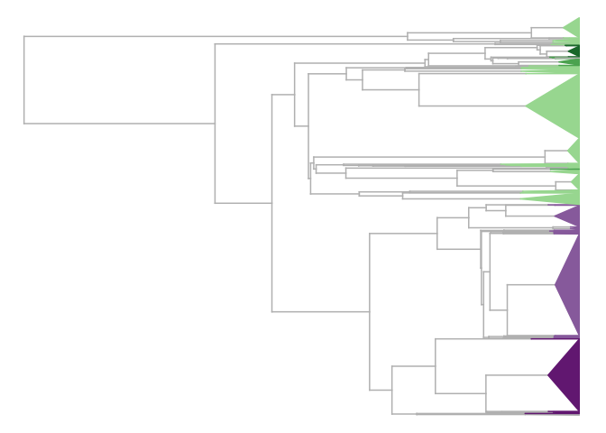

get mrcas for each clade
------------------------

``` r
    dsyMRCA<-findMRCA(tt, which(sapply(tt$tip.clade, function(y) y$label)=='D-SY'))
    dryMRCA<-findMRCA(tt, which(sapply(tt$tip.clade, function(y) y$label) %in% c('DR-Y', 'D-RY')))
    efsyMRCA<-findMRCA(tt, which(sapply(tt$tip.clade, function(y) y$label) %in% c('EFSY')))
    ecsyMRCA<-findMRCA(tt, which(sapply(tt$tip.clade, function(y) y$label) %in% c('ECSY'))[-2])
    alldMRCA<-findMRCA(tt, which(sapply(tt$tip.clade, function(y) y$label) %in% c('D-RY', 'DR-Y', 'D-SY')))
```

to combine the two, use a function and cowplot
----------------------------------------------

``` r
plot.backbonePhylo_color(tt, vscale=0.1, fixed.height=F, col=hapcolors, lwd=1.5)
```

    ## [1] 970

``` r
nodelabels('', node=dsyMRCA, col=hapcolors['D-SY'], bg = hapcolors['D-SY'], frame='circle', cex=0.5)
nodelabels('', node=dryMRCA, col=hapcolors['D-RY'], bg = hapcolors['D-RY'], frame='circle', cex=0.5)
nodelabels('', node=efsyMRCA, col=hapcolors['EFSY'], bg = hapcolors['EFSY'], frame='circle', cex=0.5)
nodelabels('', node=ecsyMRCA, col=hapcolors['ECSY'], bg = hapcolors['ECSY'], frame='circle', cex=0.5)
nodelabels('', node=alldMRCA, col=hapcolors['allD'], bg = hapcolors['allD'], frame='circle', cex=0.5)
```

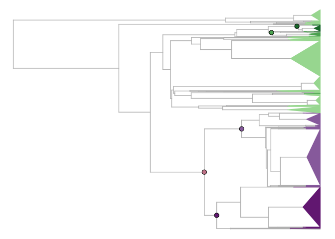

``` r
#nodelabels('', node=73, col=hapcolors['allE'], bg = hapcolors['allE'], frame='circle', cex=0.5)
#tiplabels(text='ECCY', tip=31)
#tiplabels(text='D-RY', tip=5)
#tiplabels(text='D-SY', tip=12)
#tiplabels(text='EFSY', tip=69)
#tiplabels(text='ECSY', tip=12)

treeplot.nonames=recordPlot()

treelabels=ggplot(data.frame(hapcolors=hapcolors[c('D-RY', 'D-SY', 'ECCY', 'EFSY', 'ECSY')], haplo=names(hapcolors[c('D-RY', 'D-SY', 'ECCY', 'EFSY', 'ECSY')]), position=c(2,6.5,15,18.5,17.7)), aes(x=0, y=position, color=haplo)) + annotate('text', x=0, y=c(2,6.5,15,18.5,17.7), label=names(hapcolors[c('D-RY', 'D-SY', 'ECCY', 'EFSY', 'ECSY')]), color=hapcolors[c('D-RY', 'D-SY', 'ECCY', 'EFSY', 'ECSY')]) + scale_color_manual(values=hapcolors) + theme_void() + ylim(0,20)

treeplot=plot_grid(treeplot.nonames, treelabels, ncol=2, rel_widths = c(1,0.15))

## extract legend
legend=get_legend(temperature.alle + theme(legend.position="right", legend.justification="center" , legend.text=element_text(size=8), axis.title=element_text(size=9))+ guides(colour = guide_legend(nrow = 6)) + labs(color=''))
```

    ## Warning: Removed 614 rows containing missing values (geom_path).

``` r
plot_grid(treeplot, 
          plot_grid(temperature.alle + theme(legend.position="none", axis.text=element_text(size=8), axis.title=element_text(size=9)), legend, ncol=2, rel_widths=c(1,0.25)), labels = c('A', 'B', ''), 
          scale = c(0.9, 1,1), ncol=1, rel_heights=c(0.8,0.5,0.1))
```

    ## Warning: Removed 614 rows containing missing values (geom_path).

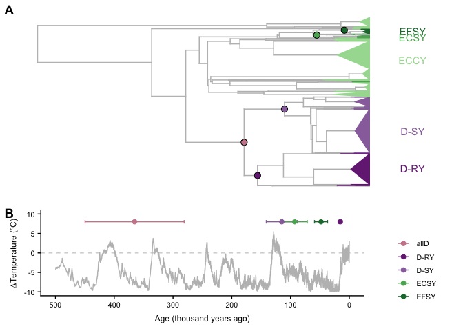

Make supplemental table 8

``` r
times.all[,c('mu', 'mu_lowgen', 'mu_highgen')]
```

    ##             mu mu_lowgen mu_highgen
    ## DRY   15523.19  11940.91   19105.46
    ## DSY  114793.04  88302.34  141283.74
    ## allD 365350.29 281038.68  449661.90
    ## allE 526315.99 404858.45  647773.52
    ## ECSY  92943.45  71494.96  114391.94
    ## EFSY  48074.20  36980.15   59168.24

``` r
#write.table(times.all[,c('mu', 'mu_lowgen', 'mu_highgen')], '~/Downloads/supp_table_8_dog1ages.txt', row.names=T, col.names=T, quote=F)
```

for supplement, add admixture groups to phylogeny
-------------------------------------------------

``` r
fainds=fread('grep ">" ~/Documents/berdeja_dog1/phylogeny/pruned_e1_aln.fa', header=F, sep='\t')
fainds$V1=gsub(pattern = ">", replacement = '', fainds$V1)
fainds$count=str_count(fainds$V1, ',')
fatips$count=fainds$count

eid=read.table('/Users/mcstitzer/Documents/berdeja_dog1/phylogeny/data_files/eid_to_srrcontig.txt', stringsAsFactors = F)
haplo$eid=as.numeric(mapvalues(haplo$V1, from=eid$V3, to=as.character(eid$V1), warn_missing=F))
```

    ## Warning: NAs introduced by coercion

``` r
eide=read.table('/Users/mcstitzer/Documents/berdeja_dog1/phylogeny/data_files/SraRunTable_1001genomes.txt', stringsAsFactors = F, sep='\t', header=T)
haplo$eid[is.na(haplo$eid)]=mapvalues(substr(gsub('_R_', '', haplo$V1[is.na(haplo$eid)]), 1,10), from=eide$Run, to=eide$Sample_Name, warn_missing=F)

admix=read.csv('/Users/mcstitzer/Documents/berdeja_dog1/phylogeny/data_files/1001genomes-accessions and 1001genomes-admixture.csv')
haplo$admix=mapvalues(haplo$eid, from=admix$id, to=as.character(admix$group), warn_missing=F)
haplo$admix[grepl('ERR', haplo$V1)]='africa'

admix$haplo=mapvalues(admix$id, from=haplo$eid, to=haplo$hap, warn_missing=F)

china=read.table('/Users/mcstitzer/Documents/berdeja_dog1/phylogeny/data_files/SraRunTable (14).txt', sep='\t', stringsAsFactors = F, header=T)
haplo$admix[gsub('\\..*', '', gsub('_R_', '', haplo$V1)) %in% china$Run]='china'

geo=haplo[haplo$admix %in% c('admixed', 'africa', 'asia', 'central_europe', 'china', 'germany', 'italy_balkan_caucasus', 'north_sweden', 'relict', 'south_sweden', 'spain', 'western_europe'),]

## not being creative here, but this works to sum membership in each admixture group.
fainds.geo=fainds
fainds.geo$admixed=sapply(fainds$V1, function(x) sum(unlist(str_split(x, ',')) %in% geo[geo$admix=='admixed',]$V1))
fainds.geo$africa=sapply(fainds$V1, function(x) sum(unlist(str_split(x, ',')) %in% geo[geo$admix=='africa',]$V1))
fainds.geo$asia=sapply(fainds$V1, function(x) sum(unlist(str_split(x, ',')) %in% geo[geo$admix=='asia',]$V1))
fainds.geo$central_europe=sapply(fainds$V1, function(x) sum(unlist(str_split(x, ',')) %in% geo[geo$admix=='central_europe',]$V1))
fainds.geo$china=sapply(fainds$V1, function(x) sum(unlist(str_split(x, ',')) %in% geo[geo$admix=='china',]$V1))
fainds.geo$germany=sapply(fainds$V1, function(x) sum(unlist(str_split(x, ',')) %in% geo[geo$admix=='germany',]$V1))
fainds.geo$italy_balkan_caucasus=sapply(fainds$V1, function(x) sum(unlist(str_split(x, ',')) %in% geo[geo$admix=='italy_balkan_caucasus',]$V1))
fainds.geo$north_sweden=sapply(fainds$V1, function(x) sum(unlist(str_split(x, ',')) %in% geo[geo$admix=='north_sweden',]$V1))
fainds.geo$relict=sapply(fainds$V1, function(x) sum(unlist(str_split(x, ',')) %in% geo[geo$admix=='relict',]$V1))
fainds.geo$south_sweden=sapply(fainds$V1, function(x) sum(unlist(str_split(x, ',')) %in% geo[geo$admix=='south_sweden',]$V1))
fainds.geo$spain=sapply(fainds$V1, function(x) sum(unlist(str_split(x, ',')) %in% geo[geo$admix=='spain',]$V1))
fainds.geo$western_europe=sapply(fainds$V1, function(x) sum(unlist(str_split(x, ',')) %in% geo[geo$admix=='western_europe',]$V1))

#fainds.geo$tiplab=tt$tip.label
fainds.geo$orighap=fatips$V1

fainds.geo.toplot=fainds.geo
rownames(fainds.geo.toplot)=fainds.geo$orighap
fainds.geo.toplot[,c('V1', 'tiplab', 'orighap')]=NULL
```

    ## Warning in `[<-.data.table`(`*tmp*`, , c("V1", "tiplab", "orighap"), value
    ## = NULL): Adding new column 'tiplab' then assigning NULL (deleting it).

``` r
plot.backbonePhylo_color(tt, vscale=0.1, fixed.height=F, col=hapcolors, lwd=1.5)
```

    ## [1] 970


``` r
#plotTree.datamatrix(as.phylo(stree), data.frame(fainds.geo))
plotTree.datamatrix(as.phylo(stree), data.frame(fainds.geo))
```

    ## Loading required package: RColorBrewer

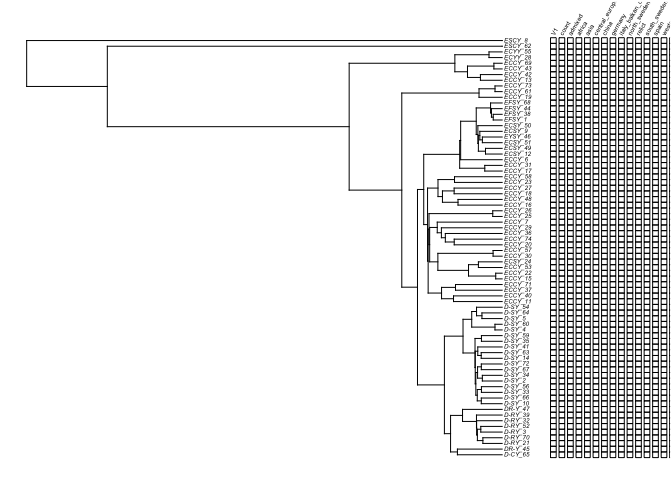

``` r
fainds.geo.toplot.matrix=as.matrix(fainds.geo.toplot)
rownames(fainds.geo.toplot.matrix)=rownames(fainds.geo.toplot)
phylo.heatmap(as.phylo(stree), fainds.geo.toplot.matrix, standardize=F)
```

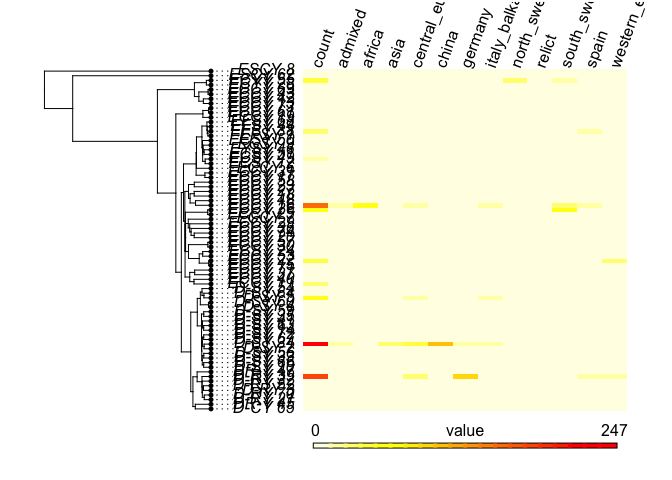

``` r
#ttback=backbone.toPhylo(tt)
#dotTree(ttback, as.matrix(fainds.geo.toplot[,1:2]))
dotTree(as.phylo(stree), fainds.geo.toplot.matrix, standardize=T)
```

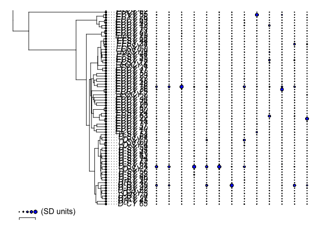

``` r
plotTree.barplot(as.phylo(stree), fainds.geo.toplot.matrix[,1], standardize=T)
```

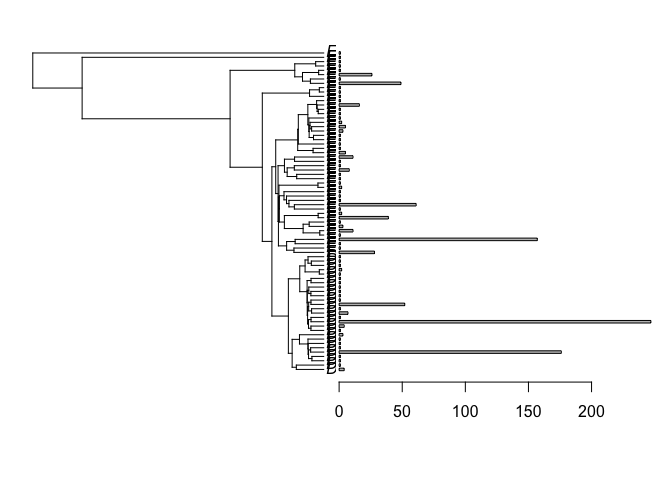

``` r
plotTree.barplot(as.phylo(stree), fainds.geo.toplot.matrix[,2], standardize=T)
title(main='admixed')
```

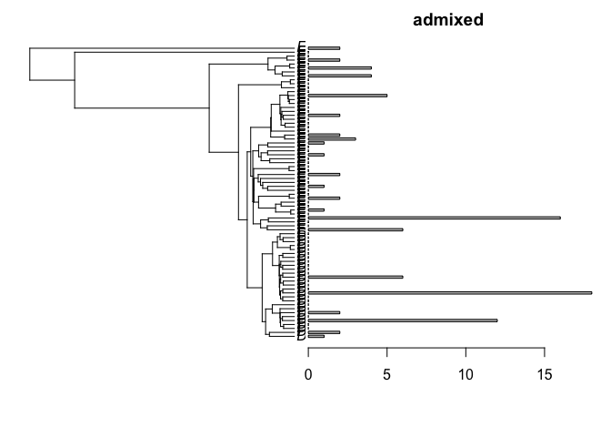

``` r
barplotcolors=c('#e6194b', '#3cb44b', '#ffe119', '#4363d8', '#f58231', '#911eb4', '#46f0f0', '#f032e6', '#bcf60c', '#fabebe', '#008080', '#e6beff', '#9a6324', '#fffac8', '#800000', '#aaffc3', '#808000', '#ffd8b1', '#000075', '#808080', '#ffffff', '#000000')[1:12]
names(barplotcolors)=c('admixed', 'africa', 'asia', 'central_europe', 'china', 'germany', 'italy_balkan_caucasus', 'north_sweden', 'relict', 'south_sweden', 'spain', 'western_europe')

plotTree.barplot(as.phylo(stree), fainds.geo.toplot.matrix[,-1]/rowSums(fainds.geo.toplot.matrix[,-1]), args.barplot=list(beside=F, col=barplotcolors, legend.text=TRUE,space=c(0,0.1),args.legend=list(x=1,y=89, cex=0.25, ncol=3, pt.cex=2)), standardize=T)
```

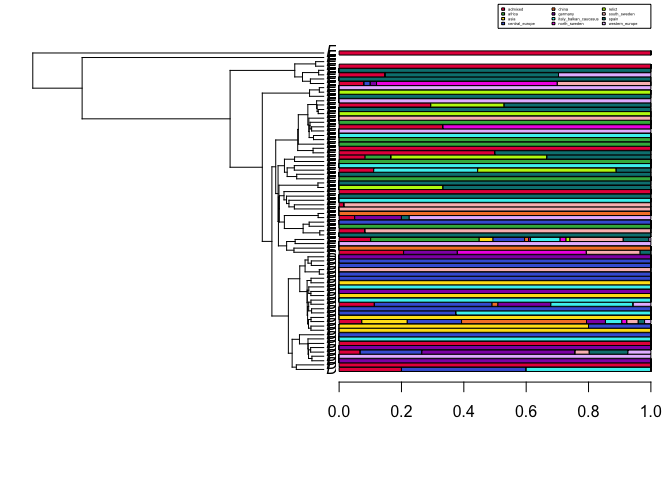

``` r
#legend(x="topright",legend=names(barplotcolors),pch=22,pt.cex=1,pt.bg=barplotcolors, box.col="transparent")

#pdf('~/Downloads/dog1_geography_vertical.pdf')

#plotTree.barplot(as.phylo(stree), fainds.geo.toplot.matrix[stree$tip.label,-1], args.barplot=list(beside=F, col=barplotcolors, legend.text=TRUE,space=c(0,0.1),args.legend=list(x=200,y=69, cex=0.35, ncol=3, pt.cex=2)), standardize=T, lwd=fainds.geo.toplot.matrix[,1])

#plotTree.barplot(as.phylo(stree), fainds.geo.toplot.matrix[,-1]/rowSums(fainds.geo.toplot.matrix[,-1]), args.barplot=list(beside=F, col=barplotcolors, legend.text=TRUE,space=c(0,0.1),args.legend=list(x=1,y=89, cex=0.25, ncol=3, pt.cex=2)), standardize=T)


#for(i in 2:13){
#plotTree.barplot(as.phylo(stree), fainds.geo.toplot.matrix[,i], args.barplot=list(beside=F, col=barplotcolors[colnames(fainds.geo.toplot)[i]], legend.text=TRUE,space=c(0,0.1),args.legend=list(x=200,y=69, cex=0.35, ncol=3, pt.cex=2)), standardize=T)
#    title(main=colnames(fainds.geo.toplot)[i])
#}

#dev.off()

#dotTree(as.phylo(stree), log10(fainds.geo.toplot.matrix+0.1), #col=rainbow(12),
#        standardize=T, legend=T)

#phylo.heatmap(as.phylo(stree), fainds.geo.toplot.matrix[,-1]/fainds.geo.toplot.matrix[,1], standardize=F, split=c(0.4,0.6))
```

for supplemental figure 17
--------------------------

``` r
## none of this will work becasue phytools redoes plotting :(
layout.matrix=matrix(c(1,1,1,2,3,4,5,6,7,8,9,10,11,12,13), nrow=3, ncol=5)

layout(mat = layout.matrix,
       heights = 1, # Heights of the two rows
       widths = c(3,1,1,1,1)) # Widths of the two columns

#layout.show(13)

## drop outgroup tips
bartree=drop.tip(as.phylo(single), c('ESCY_8', 'ESCY_62'))

SdsyMRCA<-findMRCA(bartree, which(str_split_fixed(bartree$tip.label, '_', 2)[,1]=='D-SY'))
SdryMRCA<-findMRCA(bartree, which(str_split_fixed(bartree$tip.label, '_', 2)[,1] %in% c('DR-Y', 'D-RY')))
SefsyMRCA<-findMRCA(bartree, which(str_split_fixed(bartree$tip.label, '_', 2)[,1] %in% c('EFSY')))
SecsyMRCA<-findMRCA(bartree, which(str_split_fixed(bartree$tip.label, '_', 2)[,1] %in% c('ECSY'))[-2])
SalldMRCA<-findMRCA(bartree, which(str_split_fixed(bartree$tip.label, '_', 2)[,1] %in% c('D-RY', 'DR-Y', 'D-SY')))

## lets color branches so we see haplotypes!
bartree<-paintSubTree(as.phylo(bartree),SalldMRCA,"allD","ECCY")
bartree<-paintSubTree(bartree,SdryMRCA,"DRY")
bartree<-paintSubTree(bartree,SdsyMRCA,"DSY")
bartree<-paintSubTree(bartree,SecsyMRCA,"ECSY")
bartree<-paintSubTree(bartree,SefsyMRCA,"EFSY")

geoplots=list()

plotTree.barplot(as.phylo(bartree), fainds.geo.toplot.matrix[bartree$tip.label,-1],args.plotTree=list(ftype="off", col=hapcolors),  args.barplot=list(beside=F, col=barplotcolors, legend.text=FALSE,space=c(0,0.1),args.legend=list(x=200,y=69, cex=0.35, ncol=3, pt.cex=2)), standardize=T, lwd=fainds.geo.toplot.matrix[,1])
## then over the top, we plot the colored tree branches
## this is how I go back to my tree frame
par(mfg=c(1,1))
plot(bartree,hapcolors,ftype='off',mar=c(5.1,1.1,2.1,0), lwd=2)

geoplots[[1]]=recordPlot()


for(i in 2:13){
plotTree.barplot(as.phylo(bartree), fainds.geo.toplot.matrix[bartree$tip.label,i], args.plotTree=list(ftype="off", col=hapcolors), args.barplot=list(beside=F, border=NA, col=barplotcolors[colnames(fainds.geo.toplot)[i]], legend.text=TRUE,space=c(0,0.1),args.legend=list(x=200,y=69, cex=0.35, ncol=3, pt.cex=2)), standardize=T)
    title(main=colnames(fainds.geo.toplot)[i], line = -1, outer = TRUE)
    ## then over the top, we plot the colored tree branches
## this is how I go back to my tree frame
par(mfg=c(1,1))
plot(bartree,hapcolors,ftype='off',mar=c(5.1,1.1,2.1,0), lwd=2)

    geoplots[[i]]=recordPlot()
}
```

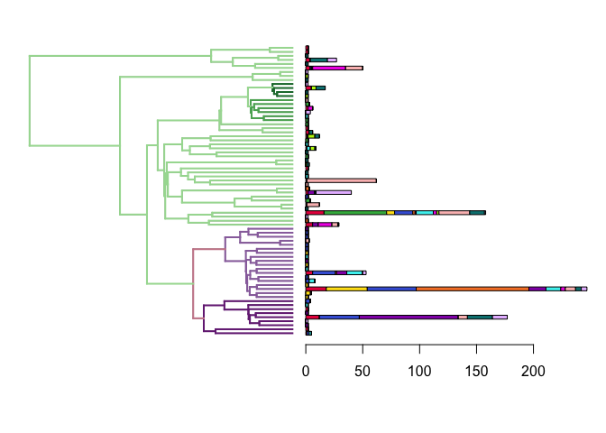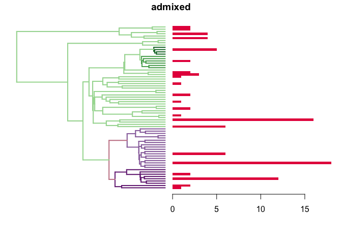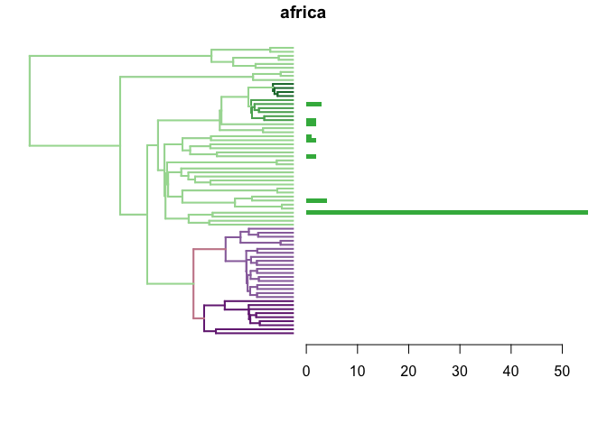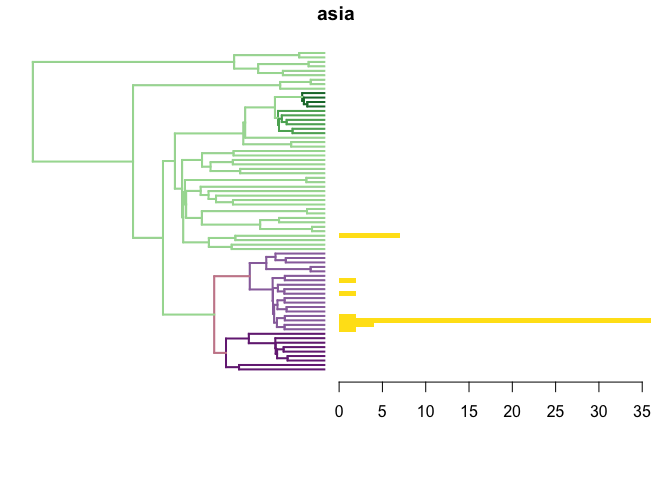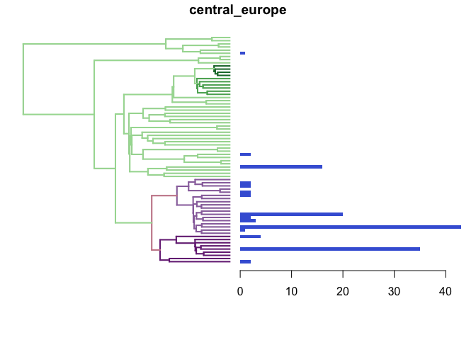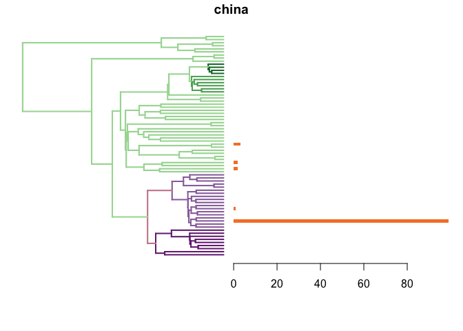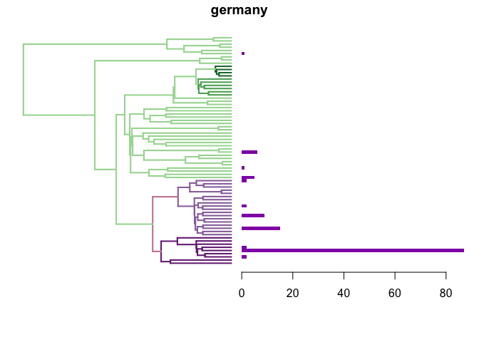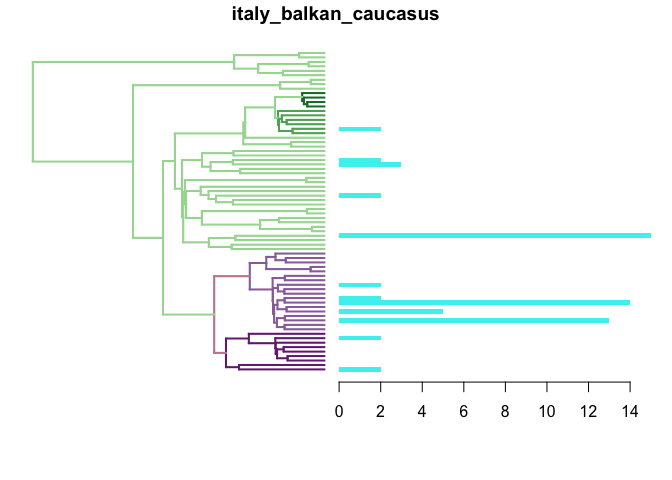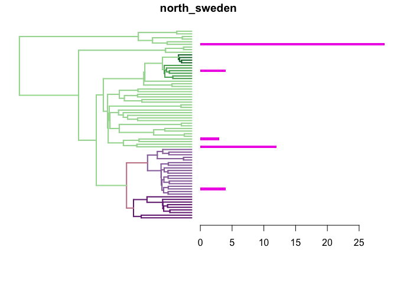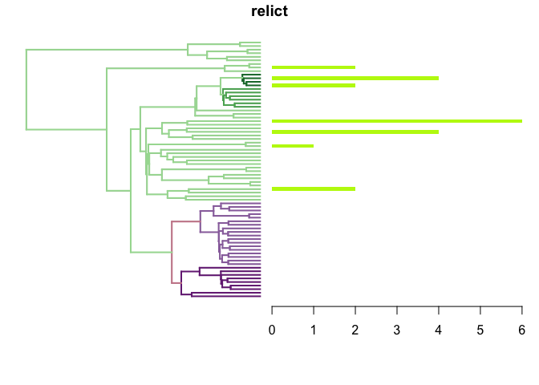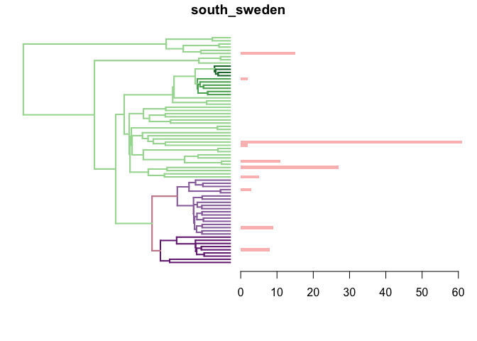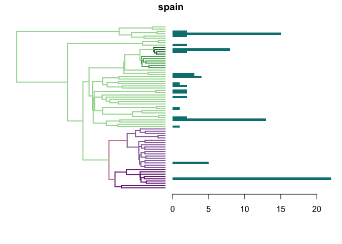

``` r
#pdf('~/Downloads/dog1_geography_supplemental.pdf', 25,15)

plot_grid(geoplots[[1]], 
plot_grid(plotlist=geoplots[-1], labels = NULL, nrow=3, scale=0.8), 
          rel_widths = c(0.5,1), ncol=2)


#dev.off()
```

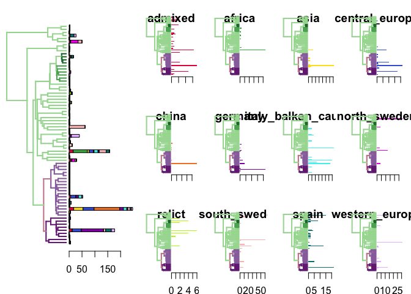

<!-- 
## why is this not working??
some indivdiuals might be heterozygous? I'm checking to see if genome-wide heterozygosity differs between these individuals, and should also check in the dog1 chromsome 5 region. 

Ugh, all of 1001 genomes is fixed to be homozygous...

-->
<!-- 
## or give up

The solution is ggtree!! -->
